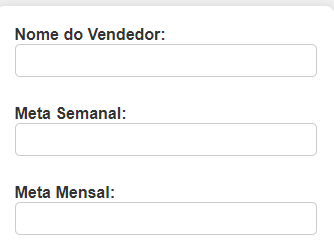

[Projeto - Aprendendo a escrever um README](#projeto---aprendendo-a-escrever-um-readme) 

[Descrição](#descri%C3%A7%C3%A3o)   

[Introdução](#introdu%C3%A7%C3%A3o)   

[Funcionalidades](#funcionalidades)   

[Tenólogias utilizadas](#tecnol%C3%B3gias-utilizadas)   

[Fontes consultadas](#fontes-consultadas)  

[autores](#autores)  
# Projeto - Sistema de Salários

## Descrição:
Este projeto consiste em um sistema de salário desenvolvida em PHP. O sistema permite que o usuário insira o nome do vendedor, as metas semanal e mensal, e calcula o salário 
final com base nas metas atingidas, exibindo o resultado ao usuário.

## Introdução: 

 Este projeto foi desenvolvido para oferecer uma solução simples e prática para calcular o salário de vendedores com base em metas de vendas.Utilizando PHP, HTML e CSS, este sistema 
 permite que o usuário insira o nome do vendedor, as metas semanal e mensal, e calcula o salário final com base nas metas atingidas, exibindo o resultado de forma clara e acessível.

## Funcionalidades:

- `Caixas de Resposta`: Solicita o nome do vendedor, a meta semanal e a meta mensal.

  

- `Calcular Salário`: Calcula o salário final com base nas metas atingidas.

 

- `Resultados`: Exibe o resultado ao usuário.

 

  

 

## Tecnológias utilizadas:

As tecnólogias utilizadas para a criação foram..

🔧HTML🔧

🔧CSS🔧

🔧GitHub🔧

🔧Visual Studio Code🔧

🔧PHP🔧

## Fontes consultadas:

[PHP](https://www.php.net/docs.php) - Documentação PHP

[MDN Web Docs](https://developer.mozilla.org/en-US/docs/Web/HTML) - Documentação HTML

[MDN Web Docs](https://developer.mozilla.org/en-US/docs/Web/CSS) - Documentação CSS

## Autores:

    Thalyta das Neves Ferreira 3A 
